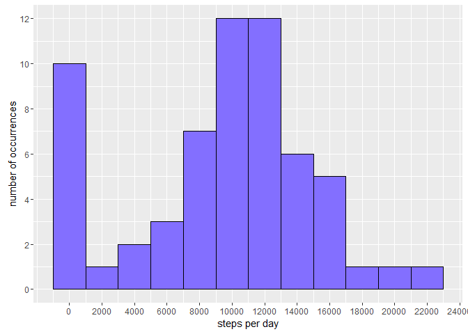
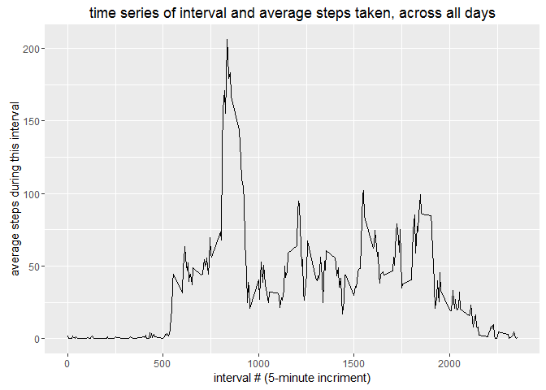
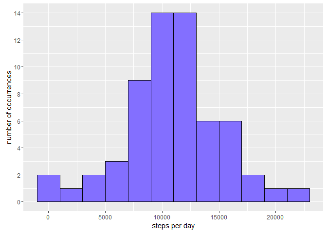
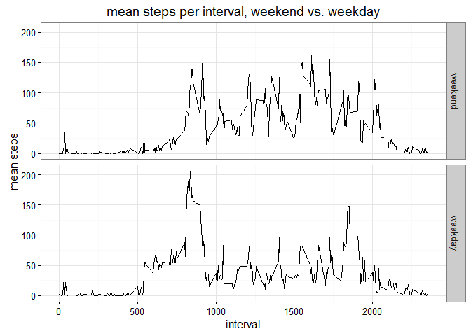

# Reproducible Research: Peer Assessment 1


## Loading and preprocessing the data

```r
activity <- read.csv(unz("activity.zip", "activity.csv"))
```

## A histogram of the steps per day
### (occurrences of number of steps per day within a range)

```r
library(ggplot2)
sum_steps_per_day <- tapply(activity$steps, activity$date, sum, na.rm = TRUE)
ggplot(mapping = aes(x = sum_steps_per_day)) + 
  geom_histogram(binwidth = 2000, color = "black", fill = "slateblue1") + 
  labs(x = "steps per day", y = "number of occurrences") + 
  scale_y_continuous(breaks = seq(0, 14, 2)) +
  scale_x_continuous(breaks = seq(0, 25000, 2000))
```

<!-- -->

### mean and median steps per day

```r
mean(sum_steps_per_day)
```

```
## [1] 9354.23
```

```r
median(sum_steps_per_day)
```

```
## [1] 10395
```

## What is the average daily activity pattern?

```r
mean_per_interval <- aggregate(steps ~ interval, data = activity, mean)
qplot(data = mean_per_interval, 
      x = interval, 
      y = steps, 
      ylab = "average steps during this interval", 
      xlab = "interval # (5-minute incriment)", 
      main = "time series of interval and average steps taken, across all days",
      geom = "line")
```

<!-- -->

### Which interval contains the highest average number of steps across all days?

```r
mean_per_interval[which.max(mean_per_interval$steps),"interval"]
```

```
## [1] 835
```

### this ^ corresponds to almost 2 pm

## Imputing missing values

```r
library(mice)
```

```
## Loading required package: Rcpp
```

```
## mice 2.25 2015-11-09
```

### Total number of missing values:

```r
print(sum(is.na(activity$steps)))
```

```
## [1] 2304
```

### Use the mice package to fill in missing values using predictive mean
### matching, then store those values back in the original activity data set

```r
activity <- complete(mice(activity, method = "pmm", seed = 1, printFlag = FALSE), 1)
```

### Make a histogram of the total number of steps taken each day

```r
sum_steps_per_day <- aggregate(steps ~ date, data = activity, sum)
ggplot(mapping = aes(x = sum_steps_per_day$steps)) + 
  geom_histogram(binwidth = 2000, color = "black", fill = "slateblue1") + 
  labs(x = "steps per day", y = "number of occurrences") + 
  scale_y_continuous(breaks = seq(0, 14, 2))
```

<!-- -->

### Recalculate mean and median of the sums of steps per day

```r
mean(sum_steps_per_day$steps)
```

```
## [1] 10885.57
```

```r
median(sum_steps_per_day$steps)
```

```
## [1] 10765
```

#### We see above ^ that the impact of imputing the missing data is that the median and mean are both increased.

## Are there differences in activity patterns between weekdays and weekends?

```r
library(lubridate)
```

```
## 
## Attaching package: 'lubridate'
```

```
## The following object is masked from 'package:base':
## 
##     date
```

```r
activity$daytype <- factor(x = rep("weekend", nrow(activity)), 
                           levels = c("weekend", "weekday"))
activity[wday(activity$date) > 1 & wday(activity$date) < 7, "daytype"] <- 
  "weekday"
ggplot(data = aggregate(steps ~ interval + daytype, data = activity, mean), 
       mapping = aes(x = interval, y = steps)) + 
  geom_line() + 
  facet_grid(daytype ~ .) +
  labs(y = "mean steps", title = "mean steps per interval, weekend vs. weekday") +
  theme_bw()
```

<!-- -->
